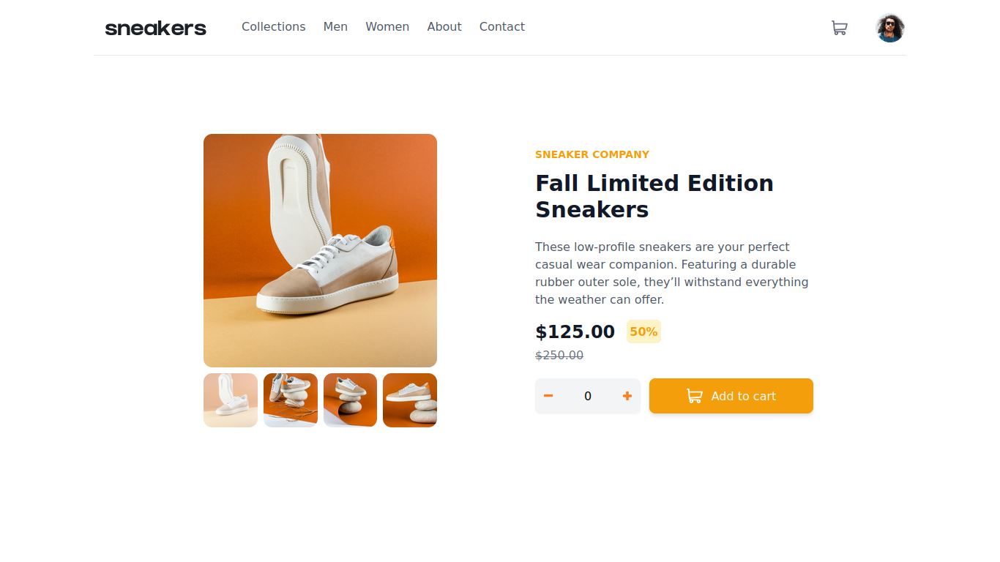

# Responsive-ecommerce-sneakers-page
Responsive ecommerce sneakers website using HTML, TailwindCss &amp; JavaScript

This is a solution to the [Responsive ecommerce sneakers page](hhttps://www.frontendmentor.io/challenges/ecommerce-product-page-UPsZ9MJp6). Frontend Mentor challenges help you improve your coding skills by building realistic projects. 

## Table of contents

- [Overview](#overview)
  - [The challenge](#the-challenge)
  - [Screenshot](#screenshot)
  - [Links](#links)
- [My process](#my-process)
  - [Built with](#built-with)
  - [What I learned](#what-i-learned)
  - [Useful resources](#useful-resources)
- [Author](#author)
- [Acknowledgments](#acknowledgments)

## Overview

### The challenge

Users should be able to:

- View the optimal layout for the site depending on their device's screen size
- See hover states for all interactive elements on the page
- Open a lightbox gallery by clicking on the large product image
- Switch the large product image by clicking on the small thumbnail images
- Add items to the cart
- View the cart and remove items from it

### Screenshot

### Links

- Solution URL: [Solution Site](https://www.frontendmentor.io/solutions/responsive-ecommerce-sneakers-page-using-tailwind-0I0Cc8fXm)
- Live Site URL: [Live Site](https://islemmedjahdi.github.io/Responsive-ecommerce-sneakers-page/)

## My process

### Built with

- tailwind CSS
- Vanilla JS

### What I learned
 
### Useful resources

- [Developer Mozzila](https://developer.mozilla.org) 
- [tailwind CSS documentation](https://tailwindcss.com/)

## Author

- Frontend Mentor - [@IslemMedjahdi](https://www.frontendmentor.io/profile/IslemMedjahdi)
- Twitter - [@IslemMedjahdi](https://twitter.com/IslemMedjahdi)

## Acknowledgments
